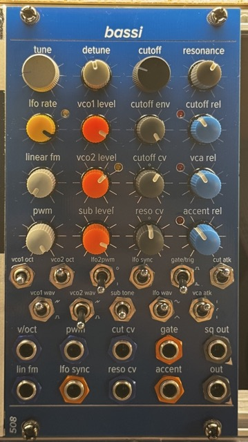

# bassi

The Bassi is a full 2-oscillator synth voice in 14HP, based around the Sound Semiconductor synth IC set, including the SSI2131 VCO chip, the SSI2140 VCF chip, and the SSI2164 VCA chip.

There is a demo of most of the major features on my YouTube: https://youtu.be/h8qL-yymZSQ

Core features include:

- VCO 1
  - 3-octave switch
  - saw/pulse waveform switch
  - Tune pot (controls both VCOs)
  - Linear FM input (controls both VCOs)
- VCO 2
  - 3-octave switch
  - saw/pulse waveform switch
  - Tune pot (controls both VCOs)
  - Detune pot
  - Linear FM input (controls both VCOs)
  - PWM CV input
  - PWM pot
  - Switchable PWM CV normalling (5v / on-board LFO)
- Suboscillator
  - 1 octave below VCO 1
  - 3-position tone switch
- Mixer
  - separate mix control for both VCOs and suboscillator
  - overdrive LED
- LFO 
  - switchable between sine and triangle
  - sync input
  - switch selects low-on-sync or high-on-sync
  - normalled to PWM, cutoff and resonance CV inputs
  - bicolor LED indicates speed and polarity
- VCF
  - 4-pole low-pass filter with resonance
  - cutoff pot
  - resonance pot
  - CV inputs with attenuverters for both cutoff and resonance
  - LFO normalled to CV inputs
  - dedicated cutoff envelope w/depth control
- envelope generators
  - gate/trigger switch (gate normalled to 5V so VCA is open w/no gate input patched)
  - attack switchable slow/med/fast for VCA & VCF envelopes separately
  - accent input (trimmers control amount of accent sent to VCA & VCF separately)
  - separate release pots for main VCA envelope, cutoff envelope, and accent envelope
- outputs
  - primary mix output
  - VCO 1 square wave output direct from VCO (bypasses mixer, filter, VCA)

This is a dense, complex build. I highly recommend having your PCB fab house do the surface-mount placement on at least one side of each board. I get the sides with all the passives done by JLCPCB, so I only have to do a handful of ICs.

You should use high-quality thin film resistors, ideally 0.1% & very low PPM, for anything that touches the v/oct calibration, for example:

- the 49.9k resistors on the i/o board that sum together the v/oct / tune / octave switches / etc
- the 10k and 20k resistors on the "power" sheet of the main board, which help set the reference voltages (+1V , -1V, +1.25V)
- any resistor that's anywhere near pins 5, 6, 12, 13, and 15 of the SSI2131s on the oscillator board

As with all my designs, this design uses 2mm pitch male/female headers -- get them from Tayda Electronics, e.g: https://www.taydaelectronics.com/connectors-sockets/pin-headers/5-pin-2-00-mm-single-row-female-pin-header.html

Because the headers are lower-profile, you'll want 1/4" standoffs. I get mine from McMaster-Carr.

Thanks to the synth DIY community, especially Thomas Henry, Ian Fritz, and Tom "Servo" Parkhurst. This module uses portions of circuits designed by them and published to Electro-Music.com for noncommercial use. These schematics and other collateral are posted by me under a Creative Commons attribution / non-commercial / share-alike license for the same reasons.

Use high-quality trimmers (e.g. TT Electronics from Mouser) for at least the 5k trimmers on the VCO -- el cheapo knockoff trimmers will make you sad.

Calibration should begin by calibrating the 1V reference using the trimmer provided.

You'll need to use the provided trimmers to get a decent sine shape & symmetry. 

There is a pin header on the back of the oscillator board which brings out the LFO and the triangle outputs of the two VCOs. There is a gerber included in this repo for a little calibration tool that's just a female header & a couple of Thonkiconns. This is super handy for getting the two oscillators in tune with each other.

The tuning process is the same for both oscillators. Start with VCO 1:

- set the octave switch to the down position
- set the "tune" pot fully counter-clockwise
- connect the VCO1 output pins on the back of the oscillator board to your tuner input
- connect a cable to the "v/oct" input and provide 0V on it (I use the CV output from my Mordax Data)
- use the "zero point" trimmer to set the lowest frequency for the VCO -- I usually do B0
- send 4V or 5V to the "v/oct" input and adjust the "v-oct-trim" pot to the note 4 or 5 octaves above your zero point
- set the "v/oct" input back to 0V and re-adjust the "zero point" to your base note
- repeat (go up to 4V or 5V, adjust "v-oct-trim", go back to 0V, adjust "zero point") until it's tracking accurately
- if you set your 1V reference correctly before beginning, you should also get accurate octave tracking via the octave switch

Now do the same thing for VCO 2:

- set the "Detune" pot to 12:00 straight up
- listen to both VCO 1 and VCO 2 (both via the pins on the back of the oscillator board)
- without re-adjusting VCO 1, set the "zero point" of VCO 2 to match that of VCO 1
- go through the tuning process above for VCO 2, always re-homing the "zero point" to be in tune with VCO 1
- by the end, with the "Detune" pot straight up, the two VCOs should stay pretty well in tune with each other across multiple octaves

Finally, set the amount of "accent" that gets sent to the VCA and the VCF cutoff to taste:

- send a repeating gate or trigger in to the main "gate" input and adjust the mixer, filter, and attack/release controls to settings that are in line with how you'll typically use the module
- send a separate gate or trigger in to the "accent" input in time with your primary gate/trigger input -- I use a clock divider for this
- adjust the "cutoff-acc" and "env-acc" to your liking -- the goal should be a noticeable volume increase (controlled by "env-acc") when the accent input is hit, and a noticeable "opening" of the VCF cutoff (controlled by "cutoff-acc") as well, but without being totally overpowering

There is a "mix symmetry" trimmer which nominally controls the symmetry of the mixer output waveform when it is being overdriven, but honestly in this design it doesn't do much & can generally be left alone. 
